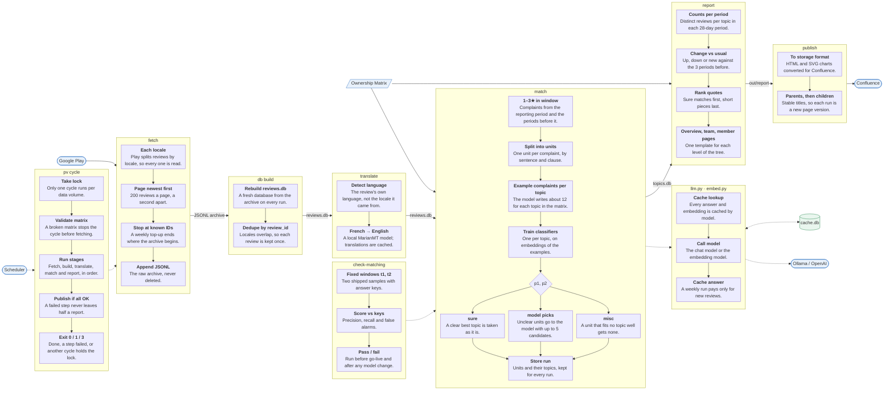

# Product View architecture

Each box is a component and the steps inside it, in order. Solid arrows carry data,
labelled with the store between the two; dotted arrows are calls.

```mermaid
%%{init: {"flowchart": {"nodeSpacing": 14, "rankSpacing": 28, "padding": 6}} }%%
flowchart LR
    SCHED([Scheduler]) -.-> CYCLE
    PLAY([Google Play]) --> INGEST
    MX[/Ownership Matrix/] --> MATCH
    MX --> REPORT

    subgraph CYCLE["pv cycle"]
        direction TB
        C1["`**Take lock**
Only one cycle runs per data volume.`"] --> C2["`**Validate matrix**
A broken matrix stops the cycle before fetching.`"] --> C3["`**Run stages**
Fetch, build, translate, match and report, in order.`"] --> C4["`**Publish if all OK**
A failed step never leaves half a report.`"] --> C5["`**Exit 0 / 1 / 3**
Done, a step failed, or another cycle holds the lock.`"]
    end

    subgraph INGEST["fetch"]
        direction TB
        I1["`**Each locale**
Play splits reviews by locale, so every one is read.`"] --> I2["`**Page newest first**
200 reviews a page, a second apart.`"] --> I3["`**Stop at known IDs**
A weekly top-up ends where the archive begins.`"] --> I4["`**Append JSONL**
The raw archive, never deleted.`"]
    end

    subgraph PREP["db build"]
        direction TB
        P1["`**Rebuild reviews.db**
A fresh database from the archive on every run.`"] --> P2["`**Dedupe by review_id**
Locales overlap, so each review is kept once.`"]
    end

    subgraph LANG["translate"]
        direction TB
        L1["`**Detect language**
The review's own language, not the locale it came from.`"] --> L2["`**French → English**
A local MarianMT model; translations are cached.`"]
    end

    subgraph MATCH["match"]
        direction TB
        M1["`**1–3★ in window**
Complaints from the reporting period and the periods before it.`"] --> M2["`**Split into units**
One unit per complaint, by sentence and clause.`"] --> M3["`**Example complaints per topic**
The model writes about 12 for each topic in the matrix.`"] --> M4["`**Train classifiers**
One per topic, on embeddings of the examples.`"] --> G{p1, p2}
        G --> S["`**sure**
A clear best topic is taken as it is.`"] & D["`**model picks**
Unclear units go to the model with up to 5 candidates.`"] & X["`**misc**
A unit that fits no topic well gets none.`"]
        S & D & X --> M5["`**Store run**
Units and their topics, kept for every run.`"]
    end

    subgraph REPORT["report"]
        direction TB
        R1["`**Counts per period**
Distinct reviews per topic in each 28-day period.`"] --> R2["`**Change vs usual**
Up, down or new against the 3 periods before.`"] --> R3["`**Rank quotes**
Sure matches first, short pieces last.`"] --> R4["`**Overview, team, member pages**
One template for each level of the tree.`"]
    end

    subgraph PUB["publish"]
        direction TB
        U1["`**To storage format**
HTML and SVG charts converted for Confluence.`"] --> U2["`**Parents, then children**
Stable titles, so each run is a new page version.`"]
    end

    subgraph MODEL["llm.py · embed.py"]
        direction TB
        Q1["`**Cache lookup**
Every answer and embedding is cached by model.`"] --> Q2["`**Call model**
The chat model or the embedding model.`"] --> Q3["`**Cache answer**
A weekly run pays only for new reviews.`"]
    end

    subgraph CHECK["check-matching"]
        direction TB
        K1["`**Fixed windows t1, t2**
Two shipped samples with answer keys.`"] --> K2["`**Score vs keys**
Precision, recall and false alarms.`"] --> K3["`**Pass / fail**
Run before go-live and after any model change.`"]
    end

    CYCLE -.-> INGEST
    INGEST -->|JSONL archive| PREP -->|reviews.db| LANG -->|reviews.db| MATCH -->|topics.db| REPORT -->|out/report| PUB --> CONF([Confluence])
    MATCH -.-> MODEL
    MODEL <-.-> CDB[(cache.db)]
    MODEL -.-> LLM([Ollama / OpenAI])
    CHECK -.-> MATCH

    classDef ext fill:#e8f1fb,stroke:#3b78c4
    classDef store fill:#e9f6ee,stroke:#2f8a55
    class SCHED,PLAY,MX,LLM,CONF ext
    class CDB store
```
